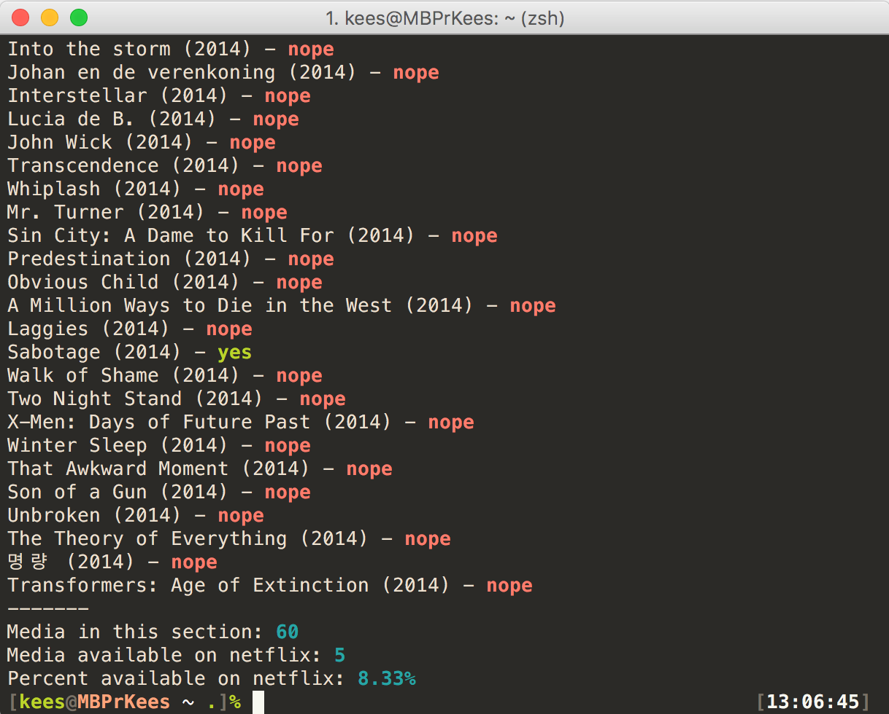

# plex2netflix

This simple tool checks how much of your media from Plex is available to watch on Netflix, and gives you a nice summary with the percentage of media that is available.

I made this tool because I someday want to make the jump to Netflix, but I want to know beforehand how much of my media is available there.

It works by using the Plex Web API to get a list of all media from given library section. If an item has an IMDb ID (you need to enable the IMDb agent for this in Plex), it uses this to search in the [Netflix Roulette API](http://netflixroulette.net/api/). If there is no IMDb ID, the item title and year are used.



To install, you need to have [Node.js](https://nodejs.org) installed. Install the tool with the node package manager:

```
npm install -g SpaceK33z/plex2netflix
```

## Usage

First, you need to get your [API token from Plex](https://support.plex.tv/hc/en-us/articles/204059436-Finding-your-account-token-X-Plex-Token).

```
plex2netflix --host 192.168.0.42 --token=xxx --section=Movies
```

If your Plex server lives at a non-default port, you can use `--port`.

Maybe you only want to know if media from this release year is already on Netflix:

```
plex2netflix --host 192.168.0.42 --token=xxx --section=Movies --year=2015
```
